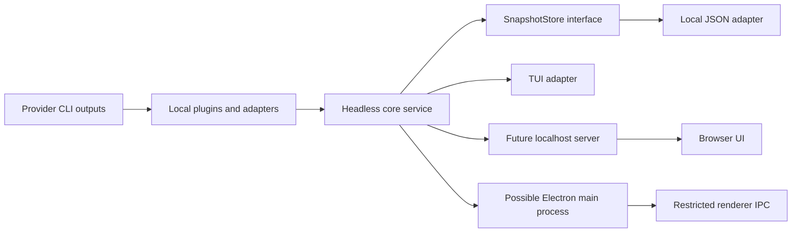

# omni-watch architecture

Decision date: **2026-10-01**. Status: accepted design for the reborn project; implementation follows [ROADMAP.md](ROADMAP.md). This change contains documentation only.

## 1. Product and evidence

**omni-watch is a personal, local-first observer of AI subscription quota windows.** It presents provider-reported consumption and resets together, using only outputs exposed locally by the providers' own CLIs. The first UI is a TUI; a browser interface is a later milestone; Electron is speculative. A headless library owns the meaning of the data, independently of all three UIs.

Goals: one useful view of Claude and Codex plan windows; truthful observation age and unavailable states; operation from cached data when CLIs are inactive; small provider adapters; reuse of the domain and collection service across UI targets.

Permanent non-goals: collecting, storing, refreshing, or forwarding credentials; app-owned provider login; private endpoint calls or scraping; hosted services or sync; API-spend tracking, subscription-price tracking, cost estimates, inferred token allowances, inference proxying, and quota enforcement. Kimi is excluded until an official remote quota API exists and can satisfy the credential-free boundary. An API balance endpoint alone does not qualify.

### Evidence and corrections to the archive

| Feed | Evidence as of this decision | Architectural consequence |
|---|---|---|
| Claude statusline | Documented stdin JSON includes optional `rate_limits.five_hour/seven_day`, with `used_percentage` on a 0–100 scale and `resets_at` in epoch seconds; subscription windows apply to Pro/Max. | Primary Claude feed; absent fields remain unknown. |
| Claude headless | `claude -p "/usage"` returned plan windows in today's live validation on **2.1.285**. | Useful manual comparison; an optional version-specific query adapter later, since its quota output schema is not a stable documented contract. |
| Codex rollouts | Today's live validation found `token_count` payloads containing `rate_limits` **beside `info`**, including `limit_id`, primary/secondary windows, credits, and plan type. | Primary Codex feed for v1; isolate the evolving local schema. |
| Codex app-server | Documented `account/rateLimits/read` exists; not needed or live-tested in today's validation. | Later opt-in query feed, with credentials managed entirely by Codex. |
| Kimi | No CLI installed or validated passive feed. | No plugin or placeholder quota card in v1. |

The [Claude statusline contract](https://code.claude.com/docs/en/statusline) documents message-driven execution, a **300 ms debounce**, cancellation of an unfinished invocation, and ANSI/multiline stdout. Its optional fields may disappear after a reset. A rerun is not proof of an upstream refresh.

The earlier [roadmap at f138eb1](https://github.com/brasillero/omni-watch/blob/f138eb1/docs/ROADMAP.md), [PR #1](https://github.com/brasillero/omni-watch/pull/1), and [PR #2](https://github.com/brasillero/omni-watch/pull/2) moved from API reporting to subscription quotas. The [archived README](https://github.com/brasillero/omni-watch/blob/35d6c88/README.md) records why app-owned OAuth failed. This design supersedes that credential architecture and the assertion that Codex has no quota interface. Keep the earlier separation of measurements from definitions, unknown from zero, and replacement from addition; do not restore the archived app or its API side track. The three supplied investigations in `/tmp/opencode/` informed this decision; today's user-provided live evidence supersedes their earlier unverified-feed caveats.

## 2. Boundaries and package layout

**Choose a small pnpm workspace with three packages now.** The additional local adapter package keeps operating-system integration out of both the domain and the UI. Do not create empty future packages.

```text
packages/
  core/       domain, plugin contracts, observation reducer, view projection,
              headless watch service, storage/clock contracts
  local/      built-in Claude/Codex plugins, filesystem/stdio/process adapters,
              JSON store, local configuration and collection lifecycle
  tui/        CLI composition, statusline command, terminal renderer/input
  web/        FUTURE: local Node server and browser client
  desktop/    SPECULATIVE: Electron main/preload/renderer composition
docs/         architecture and phased roadmap
```



Dependency rules:

- `core` imports no workspace package, terminal renderer, React, DOM, Node filesystem/process API, HTTP server, or Electron. It uses portable TypeScript data/functions and injected ports. Importing it starts nothing.
- `local` imports `core`; provider parsers and collectors never import a UI. Only this package touches provider files or starts provider processes. It has no direct provider HTTP client.
- `tui` composes `local` and `core`. Receiver and JSON entry paths do not import the renderer or enable raw input. ANSI, terminal widths, colors, and display strings belong here.
- Future web server/Electron main may import `local` and `core`. Browser/Electron renderer may import only portable core exports and sanitized DTOs. Enforce these edges with restricted-import lint rules and package export maps.

The headless service accepts a plugin registry, store, clock, and cancellation port. It ingests normalized observations, exposes `readView(now)` and a change subscription, and provides explicit `start`, `refresh`, and `stop` operations. It opens no socket and owns no global stdin/stdout. The host owns resource cleanup. Feed errors are isolated by provider; a failed collector never blanks another card.

## 3. Normalized domain and truthfulness

The pipeline is **provider feed → allowlisted observation → stored last-good window snapshots → derived view**. Raw provider envelopes never become the domain model.

Illustrative contract, to be implemented later:

```ts
type QuotaWindow = {
  id: string;                  // stable within provider + scope; not a session ID
  label: string;
  percentUsed: number;         // percentage, not a 0–1 ratio
  resetsAt: number | null;     // UTC Unix epoch milliseconds; null = unknown
  durationMinutes?: number;   // only when reported or defined by the feed contract
};

type QuotaObservation = {
  schemaVersion: 1;
  observationId: string;       // identity derived only from sanitized metadata
  providerId: string;
  scopeId: string;             // local account/profile binding; "default" in v1
  feedId: string;
  feedSchemaRevision: string;  // adapter-owned decoder revision
  cliVersion?: string;
  planType?: string;
  observedAt: number;          // UTC epoch milliseconds
  receivedAt: number;          // ingestion time; never a replacement for observedAt
  timeBasis: "receiver" | "event" | "query-response";
  windows: QuotaWindow[];
};
```

`observedAt` is receiver time for Claude statusline, the rollout record's event timestamp for Codex, and successful response time for a future query. These are observation times, not guaranteed provider measurement times. Scanning yesterday's record today retains yesterday's `observedAt`; reading cache, repainting, or pressing refresh never renews it. Statusline reruns can deliver unchanged cached provider values; `timeBasis` and the feed label make that limitation explicit.

A stored window snapshot is a window plus its observation provenance/time. Windows retain individual timestamps even when shown on one provider card. A separate feed-status record tracks `lastAttemptAt`, `lastSuccessAt`, availability, and a safe error code. It cannot overwrite last-good readings. The UI-facing projection contains age, freshness, reset state, and feed health; derive these at read time using the injected clock, rather than persisting countdowns.

### Identity and replacement

- Logical key: **`providerId + scopeId + window.id`**. Claude IDs are `five_hour` and `seven_day`. Codex IDs include meter and slot, e.g. `codex/primary` and `codex/secondary`; preserve `limit_id` and reported durations. “Weekly” is a label for a reported seven-day window, not an inferred calendar-week anchor.
- Multiple CLI sessions can report the same account window. **Never sum or average their percentages, or take their maximum.** Select the newest valid observation per key. On equal timestamps, use the provider's declared feed precedence (query before passive feed), then a deterministic observation-ID tie-break. An older observation cannot displace a newer one merely because its reset is later.
- Keep `resetsAt` as the reported cycle marker, not part of the logical key. A new observation can replace a previous cycle. Do not extrapolate the next cycle or reconstruct a rolling window from local tokens.
- Missing optional windows do not delete last-good values or refresh their timestamps. Record that the latest feed omitted them and retain their old provenance. Invalid fields reject the affected window; malformed envelopes become schema errors. Neither absence nor parse failure means 0%.
- v1 binds one account per provider/profile and does not discover identity from credentials. Session IDs are not account IDs. Historic rollouts may span account switches: rebinding requires an explicit local cache reset and a collection-start boundary that excludes older records. Until rebound, show that account scope is user-assumed; automatic account switching/multi-account aggregation is deferred.

### Freshness and resets

All adapters validate finite percentages on their declared scale, valid timestamps, unique window IDs, and bounded string lengths. For the two validated feeds, accept 0–100; reject out-of-range values rather than silently clamping. Convert epoch seconds to milliseconds **once** at the adapter boundary. `0.5` means 0.5% used. Unknown reset times remain `null`.

| Derived state | Rule | Display behavior |
|---|---|---|
| Awaiting observation | No valid window has been received. | Setup/awaiting-data explanation; no fabricated bar. |
| Recent observation | Age is under configurable `staleAfterMs` (v1 default **15 minutes**). | Percentage, reset, source, and **“last observed”** age. “Recent” describes observation age, not provider freshness. |
| Stale | Age is at least the threshold. | Keep the reading; label stale. Collection success without a new observation cannot clear it. |
| Reset passed | Known `resetsAt <= now`. | **“Reset passed; awaiting update.”** Stop the countdown; any retained percentage is explicitly a previous reading. Never invent 0%. |
| Feed unavailable/error | Disabled, missing source, unsupported plan, schema/read failure, or bounded scan incomplete. | Show feed status alongside any last-good values and their age. |
| Clock uncertain | Observation timestamp is ahead of the local clock. | Mark age uncertain; do not imply freshness. Reject implausible future feed timestamps. |

Freshness, reset state, and feed health are independent dimensions; reset-passed wording takes priority over a countdown. The stale threshold is a configurable display heuristic, not a vendor latency guarantee. Countdown ticks change presentation only. `r` rescans passive inputs; it cannot make Claude emit new quotas. No surface calls readings “live,” including a future RPC response. Store UTC instants, format local time at the UI, and do not infer reset anchors or plan prices.

`usageHistory` and `balance` are separate observation types. Historical tokens cannot establish account-wide plan utilization. If history is ever added, deduplicate requests, reconcile final records, label local-only coverage, and keep cached-input counts as a subset of inclusive input totals. Balance preserves its reported unit/currency and is never labeled spend. Neither capability is enabled in v1.

## 4. Provider plugin contract

Plugins are ordinary, reviewed TypeScript modules, not provider CLI extensions or a marketplace. The portable contract lives in `core`; the built-in implementations live in `local`.

| Contract member | Requirement |
|---|---|
| Identity | `id`, implementation `version`, and `apiVersion: 1`. |
| Capabilities | Optional implementations keyed by **`planQuotaSnapshots \| usageHistory \| balance`**; advertise only working operations. No mandatory token-history method. |
| Feed descriptors | Stable `feedId`, decoder revision, evidence level (`documented` or `observed`), acquisition mode (`push`, `scan`, `query`), and explicit refresh support. |
| Quota operation | `observe(context)` yields an async sequence of sanitized `QuotaObservation` or `FeedStatus` values. A stdin feed ends after one invocation; a watcher continues until cancelled. Other capabilities use their own DTOs. |
| Context/lifecycle | Inject allowlisted input transport, clock, scope binding, and cancellation. All files/processes close on cancellation. Errors expose typed codes, never raw envelopes. |

The local composition root registers built-in factories explicitly by provider ID. Discovery means checking configured feed paths/executable availability, without opening auth files. Unknown IDs or unsupported capabilities fail explicitly. No filesystem scanning for executable plugins, dynamic npm installation, or automatic activation. New providers first land as reviewed built-ins; any third-party loading needs a separate trust decision.

Version three things independently: plugin API major, normalized/cache schema version, and each feed decoder revision. Reject unsupported plugin API majors. Tolerate unknown vendor fields by discarding them; validate known fields strictly. An upstream breaking shape gets a new decoder revision and synthetic fixture; a changed domain meaning gets a schema migration. Store decoder/CLI versions when available; compatibility follows validated shape, with known supported CLI versions documented. Never persist a raw payload to debug schema drift.

### Claude

`omni-watch receive claude` reads one bounded stdin JSON document, projects only `rate_limits.five_hour/seven_day` and validated CLI version, stores sanitized observations, prints a compact statusline, and exits. It runs with the TUI closed. It loads no renderer, scans no transcript, and makes no query. Target completion below the 300 ms debounce interval on the supported machine; cancellations must leave the prior cache readable.

Document manual configuration of Claude's **single** statusline command using the installed binary's absolute path. Do not edit settings automatically. Existing statuslines need an explicit composition example: one wrapper reads stdin once, sends the same in-memory input separately to both commands, and controls displayed output without writing raw input to disk. Errors use short stderr codes; stdout remains statusline text.

The optional transcript reader would supply only `usageHistory`, never quota percentages. It must discard message/tool content and deduplicate repeated assistant/request records. A future headless `/usage` query is opt-in and version-gated, with a validated structured schema and process timeout; do not scrape human text or poll it in v1. It cannot reuse the statusline timestamp conversion blindly.

### Codex

Read `~/.codex/sessions/YYYY/MM/DD/*.jsonl` (or an explicitly configured CLI home). Accept records with outer `type: "event_msg"` and `payload.type: "token_count"`; **read `payload.rate_limits`, not `payload.info.rate_limits`**. `info` contains token counters, a different measurement. Null/missing limits are expected. Normalize `used_percent`, `window_minutes`, and epoch-second `resets_at`; retain the meter ID and allowlisted plan type. Ignore `credits` in v1, reserving it for a separately enabled balance capability.

Startup scans recent candidate files with bounded reads, selects by event timestamp rather than file mtime, then tails appended complete lines. Track offsets/file identity in memory; tolerate partial trailing lines, new files, truncation, and watcher loss through periodic reconciliation. A scan bound hit is visible as incomplete discovery. No full conversation indexing, auth-file reads, or raw-record logging. Sanitized observations alone enter the store.

Later, an opt-in app-server adapter may spawn `codex app-server` over **stdio**, perform `initialize`/`initialized`, and call `account/rateLimits/read` with bounded deadlines and cleanup. Use the existing CLI-managed login; send no login, token, inference, credit-consumption, or account-changing RPCs. Normalize camelCase response fields separately. Prefer `rateLimitsByLimitId` when present, otherwise `rateLimits`; never ingest both aliases as separate windows. Querying may cause Codex itself to contact its provider; local-first does not mean fresh quotas are available offline. See the [official app-server protocol and account surface](https://learn.chatgpt.com/docs/app-server).

## 5. Storage and process ownership

`SnapshotStore` is an injected interface with **`ingest(observation)`, `recordFeedStatus(status)`, `readLatest(scope?)`, and `resetScope(scope)`**. Core owns the canonical validation/reduction functions; adapters invoke them inside their atomic update to deduplicate and conditionally replace windows using Section 3 rules. Its conformance tests apply equally to an in-memory test adapter, JSON, and any later SQLite adapter. Store reads return sanitized domain data; corruption yields a safe status and preserves any recoverable last-good records.

v1 uses versioned JSON under the user's local application-state directory (`$XDG_STATE_HOME/omni-watch`, otherwise `~/.local/state/omni-watch` on Linux), with an explicit override. Keep one small document per provider/scope/feed containing last-good windows and latest feed status; no growing history archive. On POSIX, directories are 0700 and files 0600. Source paths and raw session identities stay out of snapshots.

The receiver and TUI are separate processes. **Atomic rename alone does not prevent competing read/modify/write updates.** Serialize each source document's conditional merge with a bounded interprocess lock, write a private temporary file in the same directory, flush, then rename. Compare observation times inside the lock. Use dead-owner recovery without stealing an active lock; timeouts report `store-busy` and leave the old file intact. Readers never accept partial JSON. Version migrations also hold the lock; unknown newer cache versions are not overwritten. The CLI owns temporary-file cleanup and safe status reporting.

The TUI starts Codex collectors while open, observes receiver-written Claude cache changes, and reconciles periodically in case file notifications are missed. Quit/signals stop collectors and restore the terminal. No daemon is required. When closed, Claude can still write observations; Codex activity is discovered on the next start. Multiple UIs may read the cache; locks/deduplication protect simultaneous writers.

For web, the **local Node server** owns this same store and collection service; the browser receives sanitized JSON/SSE and never opens CLI files or puts snapshots in IndexedDB/localStorage as the source of truth. No storage migration is required merely to add a browser UI. SQLite replaces the JSON adapter only if retained history/query volume or writer contention warrants transactions; it does not change the domain or move provider access into the browser.

## 6. Architecture Decision Records

All ADRs are accepted for v1 unless explicitly marked future.

| ADR | Decision | Reason and consequence |
|---|---|---|
| **001 — Language/runtime** | TypeScript, native ESM, **Node 24 LTS** baseline. | Matches available tooling and supports the local and future server hosts. Core remains portable. Use one supported runtime, not Bun/Deno adapters. [Node release policy](https://nodejs.org/en/about/previous-releases). |
| **002 — TUI** | **`log-update` + native `readline`**. | Two provider cards, bars/countdowns, `q`/`r`, and resize handling need little layout machinery. [log-update](https://github.com/sindresorhus/log-update) handles replacement output; its [manifest](https://raw.githubusercontent.com/sindresorhus/log-update/main/package.json) requires Node ≥22. [Ink](https://github.com/vadimdemedes/ink) adds React/Yoga and suits selectable panes/forms later. Browser reuse comes from the core, not terminal components. Revisit Ink only for demonstrated interaction complexity. |
| **003 — Workspace** | pnpm workspace: `core`, `local`, `tui`; future packages only when needed. | A single package with subpath exports is lighter initially but makes accidental UI/OS imports easier. Three explicit dependency boundaries justify modest setup; use `workspace:*` and pnpm recursive scripts, without Turborepo/Nx or separate repos. [pnpm workspace contract](https://pnpm.io/workspaces). |
| **004 — Snapshot storage** | Versioned, atomically replaced **JSON**, with bounded writer locks behind `SnapshotStore`. | Only latest readings/status are needed. SQLite now adds driver/migration work without a query need. Reconsider for history/contention; do not make a database prerequisite for one card. |
| **005 — Naming** | Product/binary **`omni-watch`**; CLI package **`@brasillero/omni-watch`**; internal packages `@omni-watch/core` and `@omni-watch/local`. | Align with renamed repo and avoid inheriting the old API-spend identity. Keep packages private during development; verify registry availability before any later publication. Cache/config use `omni-watch`. |
| **006 — TypeScript/tooling** | `tsc` builds/declarations and typecheck; Vitest for focused domain/adapter tests; ESLint import rules; Prettier. | Node packages use `module/moduleResolution: NodeNext`, ES2023, `strict`, `noUncheckedIndexedAccess`, `exactOptionalPropertyTypes`, and `verbatimModuleSyntax`. Core has ES libs only, no ambient Node/DOM types; local/TUI opt into Node types. Future browser config uses DOM libs and bundler resolution separately. [TypeScript resolution modes](https://www.typescriptlang.org/tsconfig/moduleResolution.html). Pin pnpm/tool versions and commit a lockfile in Phase 0; CI runs frozen install, format/lint, typecheck, tests, build. |

TUI v1 handles narrow terminals, ASCII/no-color mode, TTY detection, signal cleanup, and safe text escaping. Non-TTY output is plain one-shot text; `show --json` is a versioned headless output contract without escape codes. Neither path requires a React renderer.

## 7. Security and policy posture

The documented statusline executes locally without consuming API tokens. Receiving its quota metadata does not intermediate a Claude login. This architecture deliberately excludes the credential handling prohibited by [Anthropic's authentication rules](https://code.claude.com/docs/en/legal-and-compliance#authentication-and-credential-use). OpenAI's [app-server authentication guidance](https://learn.chatgpt.com/docs/app-server#auth-endpoints) allows continuing local/open-source integrations and excludes commercial/hosted authentication use. These sources support the chosen local boundary; internal file schemas remain compatibility risks, not public API guarantees.

- No credential interface, keyring, dotenv loading, token extraction, provider auth-file access, cookie harvesting, or app-owned sign-in. Users authenticate only in their unmodified provider CLIs. Even a future official API must fit this boundary to qualify.
- Project only window numbers/IDs, bounded safe labels, timing/provenance, and optional validated plan/version metadata. Do not persist statusline envelopes, prompt/transcript/tool content, project paths, request bodies, or arbitrary error text. Raw rollout lines may contain sensitive conversation text: parse transiently, discard unselected content, and never copy it into logs, crash reports, fixtures, or the cache.
- Read only configured feed roots; validate paths, record sizes, and known event shapes. Fixtures are synthetic or manually reduced to the allowlist. Escape all feed-originated text in terminal, HTML, and JSON consumers. No telemetry or uploads.
- Any future HTTP surface binds **only to loopback**, validates Host/Origin to resist rebinding and cross-site access, serves its own origin without permissive CORS, and exposes no arbitrary file/process endpoints. Prefer a read-only snapshot API; future mutations require a separate local access design. LAN binding/remote access is outside scope.

## 8. UI horizons

**Browser:** Add `packages/web` when Phase 3 is stable and there is a real desire for browser viewing. Its Node host composes the same local plugins, store, and core service; a thin same-origin API/SSE stream supplies the browser with the same window/freshness projection as the TUI. Portable core functions may run client-side for presentation, while collection stays on the host. This adds HTTP lifecycle, origin controls, bundling, browser rendering, and reconnect behavior. It does not require Next.js, a hosted deployment, a new quota engine, or browser credential storage; choose browser rendering tools in Phase 4.

**Electron (speculative):** A future `packages/desktop` would run the existing Node composition in the main process and reuse the browser view through a narrow, typed preload IPC bridge. Disable renderer Node integration, enable context isolation/sandboxing, and expose only sanitized view/subscription operations. Prefer IPC over adding another HTTP listener. Packaging, signing, updates, process ownership, and Electron/runtime compatibility become new work; none is required for v1 and no Electron dependency lands before that decision.
